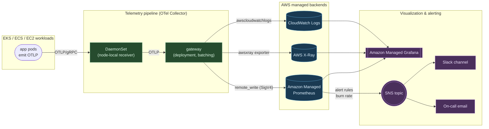

# aws-observability-stack

[](https://github.com/shivajichaprana/aws-observability-stack/actions/workflows/ci.yml)
[](https://github.com/shivajichaprana/aws-observability-stack/releases)
[](LICENSE)

A production-grade, three-pillar observability platform built entirely on AWS
managed services. Metrics land in **Amazon Managed Prometheus (AMP)**, traces in
**AWS X-Ray**, logs in **CloudWatch Logs**, and everything is unified in
**Amazon Managed Grafana (AMG)** with SLO-based alerting wired through to
**SNS / Slack**.

The OpenTelemetry Collector is the single ingestion seam — applications emit
OTLP and never need to know where the data eventually lands.

## Architecture



## Why this exists

Most teams running on AWS end up with a fragmented observability stack — a
self-hosted Prometheus running out of disk, a Grafana instance bolted onto an
EC2 box, CloudWatch metrics nobody looks at, and X-Ray traces siloed in a
different console. This project wires up the **managed** AWS observability
primitives in a way that:

- Removes the operational toil of running Prometheus and Grafana yourself.
- Uses the OpenTelemetry Collector as the single ingestion point, so apps emit
  OTLP and don't care where data eventually lands.
- Ships with SLO burn-rate alerts and a small library of dashboards that follow
  the RED method (Rate, Errors, Duration) and Google's golden signals.
- Annotates every alert with a runbook URL — pagers should not lead to "now
  what?".

## Feature table

| Capability                | How it's provided                          | Source                                  |
|---------------------------|--------------------------------------------|-----------------------------------------|
| Long-term metric storage  | Amazon Managed Prometheus (AMP)            | `terraform/amp.tf`                      |
| Distributed tracing       | AWS X-Ray via OTel `awsxray` exporter      | `otel/configmap.yaml`                   |
| Centralized log search    | CloudWatch Logs Insights                   | provider-default + workload log groups  |
| Unified dashboards & SSO  | Amazon Managed Grafana (AMG)               | `terraform/amg.tf`                      |
| OTLP ingestion            | OpenTelemetry Collector (DS + gateway)     | `otel/`                                 |
| SLO burn-rate alerts      | Multi-window Prometheus rules → AMP        | `alerts/slo-*.yaml` + `terraform/slo-alerts.tf` |
| Composite CloudWatch alarms | Aggregated SLO + infra alarms            | `terraform/composite-alarms.tf`         |
| Alert delivery            | SNS topic + Slack webhook Lambda           | `terraform/sns.tf`, `lambda/slack-notifier/` |
| Curated dashboards        | EKS, RED, RDS, Lambda                      | `dashboards/*.json`                     |
| Runbook linking           | Auto-injected URLs on every alert          | `scripts/inject-runbook-links.py`       |

## Quickstart

> Requires Terraform ≥ 1.6, AWS CLI v2, kubectl, an EKS cluster with an IRSA
> OIDC provider, and an AWS principal that can administer AMP, AMG, IAM, and
> SNS in the target account.

```bash
# 1. Configure
export AWS_REGION=ap-south-1
cp terraform/example.tfvars terraform/terraform.tfvars   # edit values
# (set amg_admin_role_arns at minimum — without it nobody can log into Grafana)

# 2. Provision the AWS-side stack (AMP, AMG, IRSA, SNS, alert rules)
make init plan
make apply ENV=dev

# 3. Deploy the OTel Collector to your EKS cluster
kubectl create namespace observability
kubectl apply -f otel/configmap.yaml
kubectl apply -f otel/collector-daemonset.yaml
kubectl apply -f otel/collector-deployment.yaml

# 4. Import dashboards
make dashboards-import      # uses terraform/dashboards.tf via the grafana provider

# 5. Confirm
kubectl -n observability rollout status ds/otel-collector
terraform -chdir=terraform output amg_workspace_url
```

End-to-end onboarding for a workload service is covered in
[`docs/otel-setup.md`](docs/otel-setup.md). SLO authoring is in
[`docs/slo-guide.md`](docs/slo-guide.md). Architecture rationale is in
[`docs/architecture.md`](docs/architecture.md).

## Repository layout

```
aws-observability-stack/
├── terraform/                # AMP, AMG, IRSA, alert rule namespaces, SNS, dashboards-as-code
│   ├── amp.tf                # Managed Prometheus workspace + log group
│   ├── amg.tf                # Managed Grafana workspace + role associations
│   ├── otel-irsa.tf          # IRSA for the Collector ServiceAccount
│   ├── slo-alerts.tf         # Loads alerts/*.yaml into AMP
│   ├── sns.tf                # Alert delivery topic + Slack-Lambda subscription
│   ├── dashboards.tf         # Imports dashboards/*.json into Grafana
│   ├── composite-alarms.tf   # CloudWatch composite alarms with runbook URLs
│   └── ...
├── otel/                     # OpenTelemetry Collector manifests + config
├── dashboards/               # Grafana dashboard JSON exports
├── alerts/                   # PromQL alert + recording rule groups
├── lambda/slack-notifier/    # SNS → Slack delivery Lambda
├── scripts/                  # Operational helpers (runbook link injection)
├── docs/                     # Architecture, SLO guide, OTel setup, runbooks
└── .github/workflows/        # Terraform + promtool + dashboard schema CI
```

## SLOs that ship out of the box

| SLO         | Target | Window  | Burn-rate windows           | Source                       |
|-------------|--------|---------|-----------------------------|------------------------------|
| Availability| 99.9%  | 30 days | 1h / 6h / 1d / 3d           | `alerts/slo-availability.yaml` |
| Latency     | 99% < 300ms (p95) | 30 days | 1h / 6h / 1d / 3d | `alerts/slo-latency.yaml`    |

Both follow the multi-window, multi-burn-rate pattern from chapter 5 of
Google's SRE Workbook — fast burn pages, slow burn opens a ticket. Add new
SLOs by following [`docs/slo-guide.md`](docs/slo-guide.md).

## CI

Every push and PR runs four parallel jobs:

- **terraform** — fmt, validate, tflint, checkov (LOW/MEDIUM soft-fail).
- **promtool**  — `promtool check rules` over `alerts/*.yaml` + custom check
  that every alert has a `runbook_url` annotation.
- **dashboards** — JSON parses, asserts unique Grafana `uid`, runs a loose
  schema validation.
- **python-lint** — ruff + black on Lambda + script code.

See [`.github/workflows/ci.yml`](.github/workflows/ci.yml).

## Versioning

This repository follows [Semantic Versioning](https://semver.org/). The
`v1.0.0` release marks the first stable surface (Terraform variables, alert
rule shapes, dashboard UIDs) and is the recommended pinning target.

## Contributing

See [CONTRIBUTING.md](CONTRIBUTING.md). PRs welcome — code-style expectations,
commit-message style (Conventional Commits), and CI gates are described there.

## License

[MIT](LICENSE)
