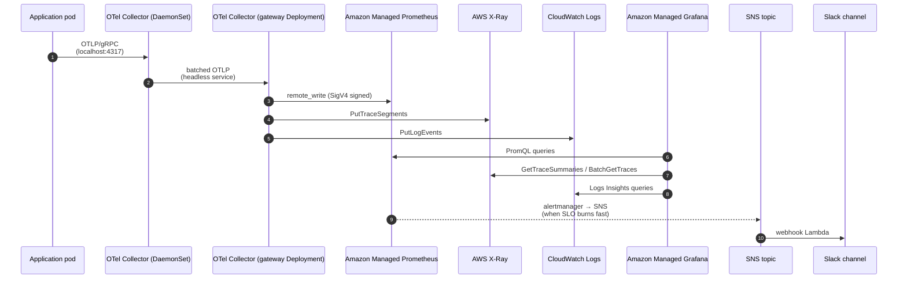

# Architecture

This document explains *why* `aws-observability-stack` is shaped the way it is.
The how lives in the Terraform; this file captures the trade-offs.

## Goals

1. **Zero ops on the storage tier.** Running highly-available Prometheus and
   Grafana is a full-time job. Every shop that tries it eventually outgrows
   their original sizing and either rearchitects in a hurry or accepts data
   loss. AMP and AMG remove that whole class of problem.
2. **A single ingestion seam.** Workloads should emit telemetry to *one* thing
   (the OpenTelemetry Collector) and never care about backend identity. That
   makes it cheap to switch backends later — swap exporters, redeploy the
   Collector, ship.
3. **Alerts that actually mean something.** Threshold alerts on `cpu > 80%`
   are noise. SLO burn-rate alerts only fire when error budget is being burned
   fast enough to matter, and every alert links to a runbook.
4. **Dashboards as code.** Every dashboard is a JSON file in `dashboards/`
   imported via Terraform. Click-ops on production dashboards drifts within
   weeks; checked-in JSON survives.

## End-to-end data flow

## Component decisions

### Why OpenTelemetry over the AWS Distro for OTel (ADOT)?

ADOT is *based* on the upstream OTel Collector — we get the same binary either
way. The decision is really about which build to deploy: ADOT pins versions
that AWS supports, while upstream gets new features faster. This stack uses
the upstream image and pins versions explicitly in `otel/collector-daemonset.yaml`,
which keeps us in lockstep with the broader OTel community.

### Why a DaemonSet *and* a Deployment?

The DaemonSet runs on every node and serves as the localhost endpoint
applications target. Apps emit OTLP to `localhost:4317` — no service mesh, no
DNS lookups, lowest possible latency.

The Deployment (gateway) sits behind a headless service and does the heavy
work: batching, memory limiting, attribute enrichment, SigV4-signed
remote-write to AMP, and exporter retry. Splitting it out means a slow AMP
endpoint backs up the gateway pods (which we can scale horizontally) without
ever stalling the node-local DaemonSet.

### Why AMP over self-hosted Prometheus?

| Concern         | Self-hosted Prom | AMP                                |
|-----------------|------------------|------------------------------------|
| HA              | Two replicas + Thanos / Cortex glue | Built-in, multi-AZ |
| Retention       | Bound by disk    | 150 days default, configurable     |
| Auth            | Bring your own   | IAM (SigV4) — no shared secrets    |
| Operational toil| Sizing, upgrades, GC tuning, WAL replay | None |
| Cost            | EC2 + EBS + ops time | Per-sample ingestion + storage   |

AMP wins on every axis except per-GB cost at very high sample volume, where
the trade vs. running Thanos starts to favor self-hosting. For shops below
~50M active samples it's not close.

### Why AMG over a Grafana EC2 box?

AMG ships with IAM Identity Center integration, audit logging, and SLAs. It
also handles plugin compatibility, which is a surprising amount of work when
you self-host. The downside: you can't run custom Grafana plugins outside the
allow-list, and the API surface is slightly restricted. For most teams that's
a fine trade.

### Why three backends instead of one?

Metrics, traces, and logs have wildly different storage characteristics:

- Metrics are tiny (8 bytes/sample), high-cardinality, queried with PromQL.
- Traces are medium-sized, sampled, queried by trace ID or service map.
- Logs are huge, low-cardinality per-message but high-volume, queried with
  regex.

A single "observability database" that tries to handle all three either does
one well and the other two badly, or scales costs through the roof. AMP +
X-Ray + CloudWatch Logs each play to their strengths and AMG unifies them at
the query/UI layer where it actually matters.

## SLO methodology

Alerts use Google's multi-window multi-burn-rate approach (SRE workbook,
chapter 5):

- A **fast burn** window (1h @ 14.4× burn rate) pages on-call within minutes
  for catastrophic regressions — 2% of the monthly budget consumed in one
  hour.
- A **slower burn** window (6h @ 6×) catches steady degradations that wouldn't
  trip the fast page.
- A **ticket-level** window (1d @ 3× and 3d @ 1×) opens a ticket on slow leaks
  that should be investigated before they consume the budget.

Recording rules pre-compute the burn-rate ratios at multiple windows so the
alert expressions stay cheap and consistent. See
[`alerts/slo-availability.yaml`](../alerts/slo-availability.yaml) for the
canonical example.

## Cost model (per month, ap-south-1, mid-size workload)

| Service           | Driver                       | Approx cost |
|-------------------|------------------------------|-------------|
| AMP ingestion     | 5M active samples            | ~$45        |
| AMP query         | ~50k queries/day             | ~$10        |
| AMG               | 5 editors + 20 viewers       | ~$140       |
| X-Ray             | 5M traces ingested + queried | ~$30        |
| CloudWatch Logs   | 200 GB ingest + 30-day retention | ~$110   |
| OTel Collector pods (EKS) | 6 × t3.small worth of compute | ~$45  |
| **Total**         |                              | **~$380**   |

These are order-of-magnitude figures, not quotes. Self-hosted equivalents
(Thanos cluster + Grafana HA + Jaeger + Loki) typically run **2–4×** higher
once you include ops time at fully-loaded engineering rates.

## What lives where

| Concern                              | File                              |
|--------------------------------------|-----------------------------------|
| AMP workspace + log group            | `terraform/amp.tf`                |
| AMG workspace + role associations    | `terraform/amg.tf`                |
| OTel IRSA                            | `terraform/otel-irsa.tf`          |
| AMG data sources (AMP, CW, X-Ray)    | `terraform/data-sources.tf`       |
| Alert rule namespaces in AMP         | `terraform/slo-alerts.tf`         |
| SLO rule YAML                        | `alerts/slo-*.yaml`               |
| Alert delivery                       | `terraform/sns.tf` + `lambda/slack-notifier/` |
| Composite CloudWatch alarms          | `terraform/composite-alarms.tf`   |
| Dashboards as code                   | `terraform/dashboards.tf` + `dashboards/*.json` |
| Collector manifests                  | `otel/*.yaml`                     |
| Runbook URL injection                | `scripts/inject-runbook-links.py` |

## Out of scope (deliberately)

- **APM SaaS comparison.** Datadog / New Relic / Honeycomb can each replace
  most of this stack at higher per-host cost. The trade-off is data
  egress and vendor lock-in; this project bets on AWS-native ownership.
- **Synthetic monitoring.** Use CloudWatch Synthetics or a dedicated tool
  (Checkly, Datadog Synthetics) — not solved here.
- **RUM / Frontend.** Use CloudWatch RUM or a dedicated tool.
- **Cost anomaly detection.** AWS Cost Anomaly Detection covers this and
  shouldn't be re-implemented in Prometheus.

## See also

- [`docs/otel-setup.md`](otel-setup.md) — how to onboard a workload service.
- [`docs/slo-guide.md`](slo-guide.md) — how to add a new SLO.
- [`docs/runbooks/`](runbooks/) — runbook templates linked from alerts.
